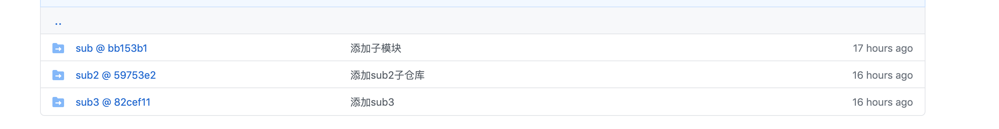
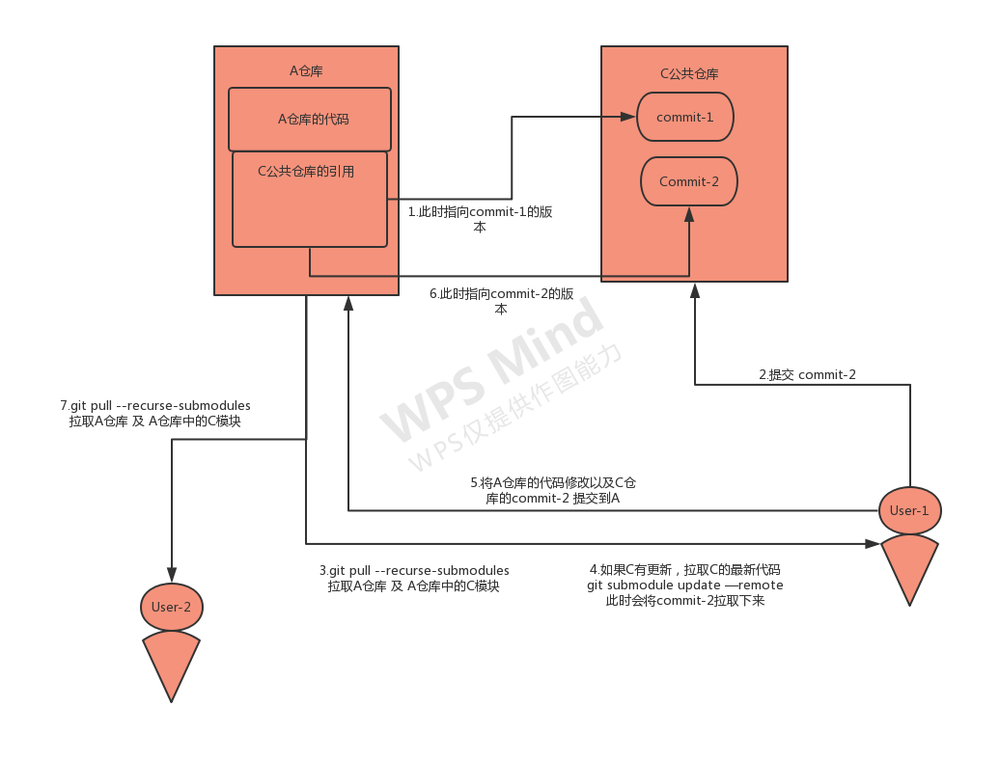

# 公共代码库
## 两种方案
> 1. 使用npm包 2. git子模块
## 1. npm包
>项目中经常使用
## 2. git 子模块
### 2.1 参考文档
>https://git-scm.com/book/zh/v2/Git-%E5%B7%A5%E5%85%B7-%E5%AD%90%E6%A8%A1%E5%9D%97
### 2.2 简单的开发流程
>所有git命令行操作都在A仓库的git根目录下完成,无需进入子模块，建议不要在A仓库中修改C的代码，修改C的代码要到C的仓库中修改。
### 2.3 开始使用子模块
#### 2.3.1 为一个仓库A添加一个子模块C
```
git submodule add 仓库地址 src/commonModules 
// 'src/commonModules'是文件路径，建议使用相对路径，本例中C仓库的代码会被下载到src下面的commonModules文件夹
```
#### 2.3.2 根目录多了了一个.gitmodules文件,记录了子模块的信息
```
[submodule "src/commonModules"]
	path = src/commonModules
	url = git地址
```
#### 2.3.2 git status 查看当前状态
```
Changes to be committed:
  (use "git reset HEAD <file>..." to unstage)

	new file:   .gitmodules
	new file:   src/commonModules
```
#### 2.3.3 git commit -m "添加子模块"
```
[master 7822bff] 添加子模块
 2 files changed, 4 insertions(+)
 create mode 160000 src/commonModules
 //注意 src/commonModules 记录的 160000 模式。 这是 Git 中的一种特殊模式，意味着你是将一次提交记作一项目录记录的，而非将它记录成一个子目录或者一个文件。
```
### git 远程仓库里面的子模块

### 流程图

### 2.4. 老的仓库(还没配置子模块的) 如何更新
```
git pull // 拉取代码 得到.gitmodule文件
git submodule init // 初始化
git submodule update // 完成子模块的更新
```
### 2.5 .已经初始化过的仓库如何更新
```
git pull --recurse-submodules //更新仓库A及A仓库内的模块C
git submodule update --remote // 拉取子模块C的最新代码
```
## 针对运营后台，两种方案对比
| 方案       | npm  |  git子模块  |
| --------   | -----  | ----  |
| 优点    | 安装配置方便 npm install packageName -S |  1.按需引入，不会造成代码包大的问题 2.开发维护简单    |
| 缺点        |  1.基于antd,打出的npm包体积大 2.使用的时候没有代码提示3.项目里面会有大量代码重复  |  前期需要一点配置   |


